# Diseño Orientado al Dominio (DDD) - Core del Sistema Educativo

Este documento describe el plan arquitectónico implementado para el Sistema Educativo.

## Estado Actual
> [!IMPORTANT]
> **Base de Datos Desplegada**: El esquema de base de datos (`01_init.sql`) ha sido finalizado y probado. Incluye soporte para Multi-Tenancy, Seguridad Avanzada, Protección de Menores y Features para IA.

## Módulos Implementados en Base de Datos

1.  **Shared Kernel (Identidad)**: Separación estricta entre `PERSONAS` (Humanos únicos) y `ACTORES_DOMINIO` (Roles en Instituciones).
2.  **Seguridad & Accesso**:
    *   **RBAC Granular**: Roles, Permisos y Perfiles.
    *   **Contextual**: Un usuario puede tener diferentes permisos por Institución.
3.  **Privacidad**: Sistema de consentimiento para menores de edad (`CONSENTIMIENTOS`, `POLITICAS_PRIVACIDAD`).
4.  **Auditoría**: Logs inmutables de cambios y eventos de dominio.
5.  **IA Readiness**: Tabla `FEATURES_APRENDIZAJE` para almacenar vectores o métricas de comportamiento anonimizadas.

## Diagrama ER Final (PostgreSQL)

```mermaid
erDiagram
    %% =========================================================
    %% SHARED KERNEL – IDENTIDAD
    %% =========================================================
    PERSONAS ||--o{ USUARIOS : "autenticación"
    PERSONAS ||--o{ ACTORES_DOMINIO : "proyecta en"
    
    PERSONAS {
        uuid id PK
        string dni_pasaporte UK
        string nombres
        string apellidos
        date fecha_nacimiento
        string genero
        jsonb metadata
    }

    USUARIOS {
        uuid id PK
        uuid persona_id FK
        string username UK
        string password_hash
        boolean doble_factor_activo
    }

    %% =========================================================
    %% TENANT & ACTORES
    %% =========================================================
    INSTITUCIONES ||--o{ ACTORES_DOMINIO : "registra"
    ACTORES_DOMINIO ||--|{ ESTUDIANTES : "es rol"
    ACTORES_DOMINIO ||--|{ PROFESORES : "es rol"
    ACTORES_DOMINIO ||--o{ RELACION_FAMILIAR : "es pariente"

    INSTITUCIONES {
        uuid id PK
        string nombre
        string ruc_tax_id UK
        jsonb configuracion
    }

    ACTORES_DOMINIO {
        uuid id PK
        uuid persona_id FK
        uuid institucion_id FK
        string tipo "ESTUDIANTE, PROFESOR, APODERADO"
        string estado
        jsonb metadata
    }

    %% =========================================================
    %% ROLES, PERMISOS Y PERFILES (RBAC Complejo)
    %% =========================================================
    ROLES ||--o{ ROL_PERMISOS : "agrupa"
    PERMISOS ||--o{ ROL_PERMISOS : "concede"
    
    INSTITUCIONES ||--o{ PERFILES : "define"
    ROLES ||--o{ PERFILES : "basa en"
    PERFILES ||--o{ PERFIL_PERMISOS : "personaliza"
    PERMISOS ||--o{ PERFIL_PERMISOS : "tiene"
    
    USUARIOS ||--o{ USUARIO_PERFILES : "tiene"
    PERFILES ||--o{ USUARIO_PERFILES : "asignado a"
    INSTITUCIONES ||--o{ USUARIO_PERFILES : "en contexto"

    ROLES {
        uuid id PK
        string codigo UK
        string nombre
    }

    PERMISOS {
        uuid id PK
        string codigo UK
        string recurso
        string accion
    }

    PERFILES {
        uuid id PK
        uuid institucion_id FK
        uuid rol_id FK
        string nombre
        boolean es_default
    }

    USUARIO_PERFILES {
        uuid usuario_id FK
        uuid perfil_id FK
        uuid institucion_id FK
        boolean activo
    }

    %% =========================================================
    %% ESTRUCTURA ACADÉMICA
    %% =========================================================
    INSTITUCIONES ||--o{ PERIODOS_ACADEMICOS : "gestiona"
    INSTITUCIONES ||--o{ NIVELES_EDUCATIVOS : "ofrece"
    NIVELES_EDUCATIVOS ||--o{ GRADOS : "contiene"
    GRADOS ||--o{ SECCIONES : "divide en"
    SECCIONES ||--o{ ASIGNATURAS : "imparte"

    PERIODOS_ACADEMICOS {
        uuid id PK
        string nombre
        date fecha_inicio
        date fecha_fin
    }

    GRADOS {
        uuid id PK
        uuid nivel_id FK
        string nombre
    }

    SECCIONES {
        uuid id PK
        uuid grado_id FK
        uuid aula_id FK
        string nombre
    }

    ASIGNATURAS {
        uuid id PK
        uuid seccion_id FK
        uuid profesor_id FK
        string nombre
    }

    %% =========================================================
    %% CICLO VIDA ESTUDIANTE
    %% =========================================================
    ESTUDIANTES ||--o{ MATRICULAS : "inscrito en"
    PERIODOS_ACADEMICOS ||--o{ MATRICULAS : "corresponde a"
    SECCIONES ||--o{ MATRICULAS : "asignado a"
    
    MATRICULAS ||--o{ CALIFICACIONES : "tiene notas"
    ASIGNATURAS ||--o{ CALIFICACIONES : "en curso"

    ESTUDIANTES {
        uuid id PK
        uuid actor_id FK
        string codigo_matricula
    }

    MATRICULAS {
        uuid id PK
        uuid estudiante_id FK
        uuid periodo_id FK
        uuid seccion_id FK
        string estado
    }

    CALIFICACIONES {
        uuid id PK
        uuid matricula_id FK
        decimal valor
        jsonb rubrica
        text feedback
    }

    %% =========================================================
    %% FAMILIA
    %% =========================================================
    ESTUDIANTES ||--o{ RELACION_FAMILIAR : "tiene"
    
    RELACION_FAMILIAR {
        uuid id PK
        uuid estudiante_id FK
        uuid actor_familiar_id FK
        string parentezco
        boolean es_apoderado_financiero
    }

    %% =========================================================
    %% PRIVACIDAD Y CONSENTIMIENTO
    %% =========================================================
    INSTITUCIONES ||--o{ POLITICAS_PRIVACIDAD : "publica"
    CLASIFICACION_DATOS ||--o{ METADATOS_PRIVACIDAD : "cataloga campo"
    
    PERSONAS ||--o{ CONSENTIMIENTOS : "menor protegido"
    ACTORES_DOMINIO ||--o{ CONSENTIMIENTOS : "quien autoriza"
    POLITICAS_PRIVACIDAD ||--o{ CONSENTIMIENTOS : "acepta"

    POLITICAS_PRIVACIDAD {
        uuid id PK
        string version
        boolean vigente
    }

    CLASIFICACION_DATOS {
        uuid id PK
        string nivel "PUBLICO, CONFIDENCIAL, SENSIBLE"
    }

    CONSENTIMIENTOS {
        uuid id PK
        uuid persona_menor_id FK
        uuid actor_responsable_id FK
        boolean otorgado
        timestamp fecha_otorgado
    }

    %% =========================================================
    %% AUDITORIA & EVENTOS
    %% =========================================================
    USUARIOS ||--o{ AUDITORIA_LOGS : "genera log"
    USUARIOS ||--o{ EVENTOS_ACCESO_DATOS : "accede dato"
    INSTITUCIONES ||--o{ EVENTOS_DOMINIO : "origen evento"

    AUDITORIA_LOGS {
        uuid id PK
        string accion
        jsonb valor_anterior
        jsonb valor_nuevo
    }

    EVENTOS_DOMINIO {
        uuid id PK
        string tipo_evento
        jsonb payload
    }

    %% =========================================================
    %% ONBOARDING & IA
    %% =========================================================
    SOLICITUDES_INGRESO ||--o{ DOCUMENTOS_ADJUNTOS : "adjunta"
    ESTUDIANTES ||--o{ FEATURES_APRENDIZAJE : "analisis IA"

    SOLICITUDES_INGRESO {
        uuid id PK
        string estado
        jsonb datos_crudos
    }

    FEATURES_APRENDIZAJE {
        uuid id PK
        string feature_codigo
        numeric valor
        boolean anonimo
    }
```

